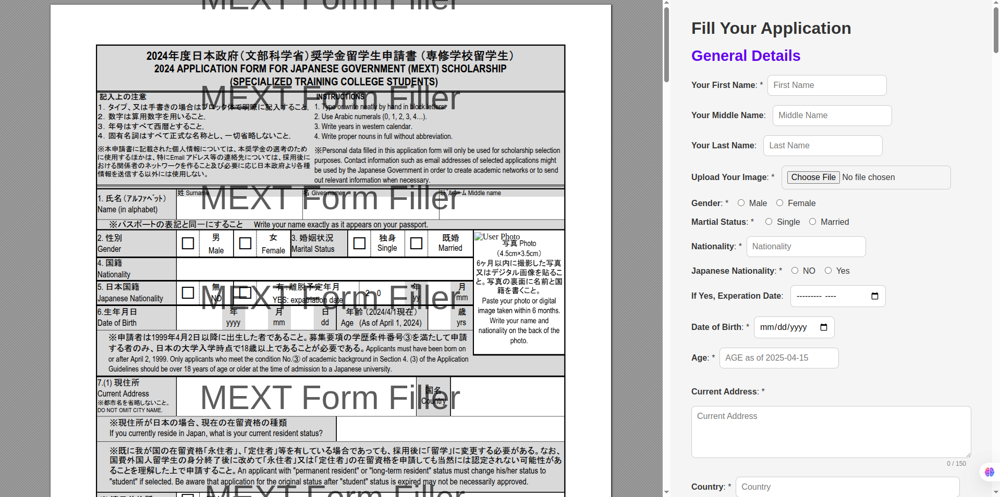

# 📝 Form Filler (Front End)

A form-filling web application frontend built with HTML, CSS, and JavaScript, designed for seamless integration with any backend. It enables users to select templates, fill out input forms with live previews, pay for submission, and download secured filled documents—all while enforcing strong content protection.

---

## 📚 Table of Contents

- [Features](#-features)
- [Tech Stack](#-tech-stack)
- [Folder Structure](#-folder-structure)
- [Installation Instructions](#-installation-instructions)
- [Usage Instructions](#-usage-instructions)
- [Security Measures](#-security-measures)
- [API Endpoints](#-api-endpoints-django-backend)
- [Live Preview Mapping](#-live-preview-mapping)
- [Environment Variables](#-environment-variables)
- [Screenshots](#-screenshots)
- [License & Contributions](#-license--contributions)
- [Integration Tip](#-integration-tip)

---

## 📌 Features

- 🔍 Select from multiple HTML form templates
- ✍️ Live preview syncing via `data-target` attributes
- 🔐 Robust front-end security: no screenshot, copy, dev tools, or right-click access
- 💳 Razorpay payment integration
- 📥 Secure file download after payment
- 🧼 Automatic cleanup via backend API post-download
- 📄 Template converter used: [CloudConvert](https://cloudconvert.com/) for PDF/DOCX to HTML

---

## ⚙️ Tech Stack

- HTML5
- CSS3
- JavaScript (Vanilla)
- AJAX for API integration

---

## 📁 Folder Structure

```
Form-Filler-Frontend/
├── README.md
├── index.html
├── preview.html
├── payment.html
├── assests/
│   ├── applicationForms/
│   │   └── STC.html
│   ├── css/
│   │   ├── form.css
│   │   ├── index.css
│   │   ├── payment.css
│   │   └── preview.css
│   ├── js/
│   │   ├── form.js
│   │   ├── index.js
│   │   ├── payment.js
│   │   └── preview.js
│   └── applicationInputform/
│       └── specialized_training_college.html
```

---

## 🛠️ Installation Instructions

1. Clone the repository:
   ```bash
   git clone https://github.com/your-username/form-filler-frontend.git
   ```
2. Ensure your backend is configured as per the API endpoints below.
3. Update any placeholder URLs in JS files to match your backend domain.
4. Open the project in **VS Code** and install the **Live Server extension**.
5. Start the server or open `index.html` directly in your browser.

---

## 🚀 Usage Instructions

- Open `index.html`
- Select a form template
- Fill in the form (live preview is shown)
- Click **Preview Final Application** to see the filled HTML
- Enter phone number and promo (optional) → Pay via Razorpay
- After payment, download your filled document
- Once downloaded, the backend will auto-delete the file for security

---

## 🔐 Security Measures

- Screenshot, right-click, dev tools, and copy-paste are disabled on preview and form pages
- Uses JavaScript protections + backend validation
- Content only available after secure payment

---

## 🌐 API Endpoints (Django Backend)

```python
# Template APIs
path('api/template/list/', FetchTemplates.as_view())
path('api/get_field_list/', GetAllFields.as_view())

# Form and Preview APIs
path('api/preview_file/', PreviewAPI.as_view())

# Payment and Billing APIs
path('billing/create_order/', RazorPayCheckoutAPI.as_view())
path('billing/webhook/', RazorpayWebhookAPIView.as_view())

# Cleanup API
path('api/filled_doc/delete/<str:pk>/', DeleteFilledTemplate.as_view())
```

> All frontend JS files (like `form.js`, `preview.js`) already contain the required `fetch` calls and localStorage logic for these APIs.

---

## 🔧 Backend API Integration Guide

To connect the frontend with your backend, update the API URLs in the following JavaScript files:

| File        | API Purpose                          | Line Example |
|-------------|---------------------------------------|--------------|
| `index.js`  | Fetch list of available templates     | `fetch("http://127.0.0.1:8000/api/get_field_list/")` |
| `form.js`   | Submit form data for preview          | `fetch("http://127.0.0.1:8000/api/preview_file/")` |
| `preview.js`| Create payment order (Razorpay)       | `fetch("http://127.0.0.1:8000/billing/create_order/")` |
| `payment.js`| Delete filled template after download | `fetch(\"http://127.0.0.1:8000/api/filled_doc/delete/\${templateId}/\")` |

> **Replace** all instances of `http://127.0.0.1:8000` with your production backend domain or deployed backend URL.

For example:

```js
// Before
fetch("http://127.0.0.1:8000/api/preview_file/")

// After
fetch("https://api.yourdomain.com/api/preview_file/")
```

It's recommended to centralize your base API URL in a `config.js` file for easier maintenance.

---


## 🧪 Live Preview Mapping

- All input fields use `data-target` attributes to bind to elements inside the template HTML (`<span id="fullName">`)
- Templates must be converted from PDF/DOCX to HTML using CloudConvert and tagged accordingly
- Live data sync is handled via JS and stored temporarily in localStorage

---

## ✅ Environment Variables

There are **no environment variables** needed for the frontend.

---

## 📸 Screenshots



---

## 📄 License & Contributions

This project is **open source** and available under the [MIT License](LICENSE).  
Contributions, issues, and feature requests are welcome!

To contribute:

1. Fork the repository
2. Create a new branch: `git checkout -b feature-name`
3. Commit your changes: `git commit -m 'Add some feature'`
4. Push to the branch: `git push origin feature-name`
5. Submit a pull request

---

## 🤝 Integration Tip

> Ensure your backend CORS settings allow requests from the frontend's domain. Also, update all backend API URLs in `form.js`, `index.js`, `preview.js`, and `payment.js`.

---